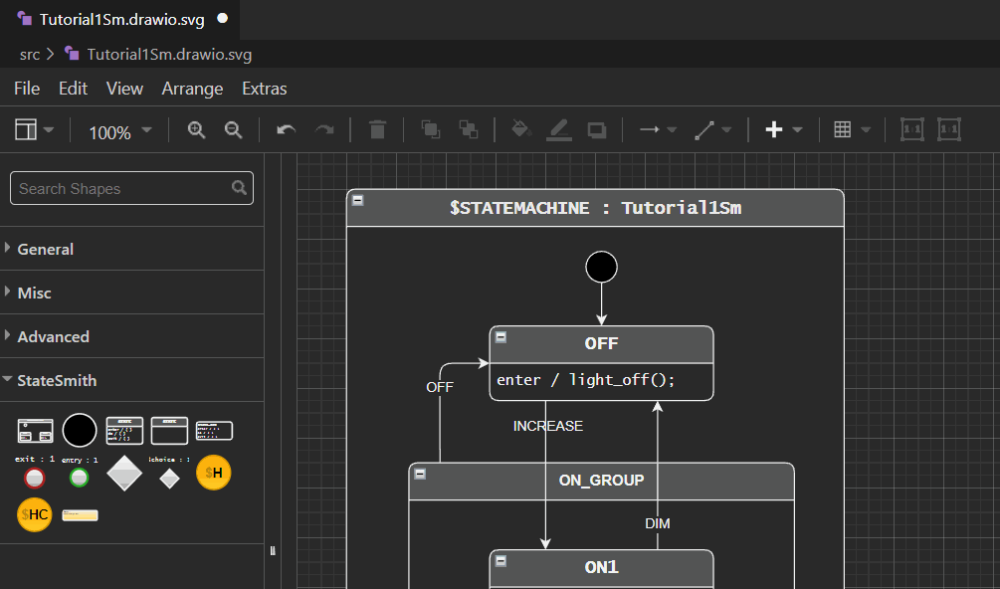

## Get vscode draw.io extension
Download vscode draw.io extension: https://marketplace.visualstudio.com/items?itemName=hediet.vscode-drawio

---

## Use StateSmith v0.7.3+
StateSmith v0.7.3 or later is when support for this plugin was added. https://github.com/StateSmith/StateSmith/blob/v0.7.3-alpha/CHANGELOG.md#073-alpha

---

## Quick start
Download StateSmith project from [v0.7.3](https://github.com/StateSmith/StateSmith/archive/refs/tags/v0.7.3-alpha.zip), extract and open vscode in `examples\Tutorial1-complete` directory.

Open the `src/Tutorial1Sm.drawio.svg` file, the vscode-drawio extension will ask you if you want to load the `StateSmith-drawio-plugin`:

  

Click `Allow` if you trust it. I do :)

You should only have to do this once. The vscode-drawio extension will remember your choice. You will, however, get another prompt if you alter the plugin .js file or select a different plugin.

You can skip the next section.

---

## Setup vscode project to use StateSmith-drawio-plugin
If you are doing the quick start, you can skip this section. This section describes what you need to do for a general vscode project.

Download the StateSmith plugin file you want to use from https://github.com/StateSmith/StateSmith-drawio-plugin/releases

Look under assets and select the .js file.

<details>
  <summary>Click here to see gif</summary>

  
</details>

Note that the example Tutorial1-complete project has a [small script](https://github.com/StateSmith/StateSmith/blob/63090d992be5be33abf1086d57664be0999421fd/examples/Tutorial1-complete/get-vscode-drawio-plugin.sh) to download the plugin.

Move the .js file to your vscode project dir (or somewhere else if you adjust the below path to match).

Enable the StateSmith plugin by editing [.vscode/settings.json:](https://github.com/StateSmith/StateSmith/blob/63090d992be5be33abf1086d57664be0999421fd/examples/Tutorial1-complete/.vscode/settings.json)
```json
{
    "hediet.vscode-drawio.plugins": [
        {"file": "${workspaceFolder}/StateSmith-drawio-plugin-v0.1.0.js"}
    ]
}
```

When you open a draw.io file now, the vscode extension will prompt you if you want to load the StateSmith-drawio-plugin:

  

Click `Allow` if you trust it. I do :)

You should only have to do this once. The vscode-drawio extension will remember your choice. You will, however, get another prompt if you alter the plugin .js file or load a new one.

---

## Using the `StateSmith-drawio-plugin` plugin

The left sidebar should show StateSmith shapes. You can drag these onto your drawing or click them to insert.


Note: you don't have to use these shapes for StateSmith to work with draw.io files, but they are pretty handy.

Note: you can style these shapes however you want. StateSmith doesn't care **EXCEPT** for text nodes like below that set the parent node's event handlers. Those text nodes must have have matching style elements (in any order): `fillColor=none;gradientColor=none;strokeColor=none;resizable=0;movable=0;deletable=0;rotatable=0;`. You can safely change their font family, size and stuff.


Two buttons are added to the top toolbar as well. They help enter and exit groups:



